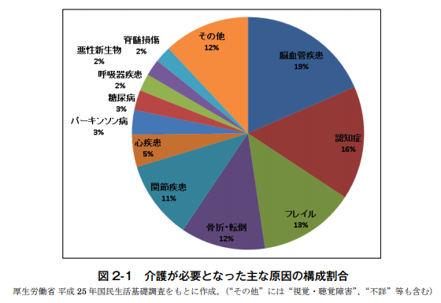

# システム科学技術を用いた予測医療による健康リスクの低減 まとめ

## サマリー
- JST(科学技術振興機構)CRDS(研究開発戦略センター)はH25年に、研究開発戦略のテーマ選定を行った。本書はこのうち健康・医療に関するテーマで調査検討した結果をまとめたもの。
- 健康・医療関連データが大量に得られるようになる近未来の社会を念頭に、発症や重症化のリスクを予測し制御するデータ融合型の新たな技術体系の確率を示した。

- **健康**とは、「生体がストレスや感染等の外的入力に対して速やかで適切な反応・回復ができる動的状態にあること」
- 疾患を発症したりその憎悪が顕在化する直前には、外的入力に対する脆弱性が高まった中間的状態が存在すると考えられるが、**健康リスク**とは生体がこの状態にある可能性を意味し、疾患ごとに徴候の増減が推定できる。健康リスク制御システムでは、この定量化された徴候が制御対象の出力(制御量)あるいは観測量となる。
- 慢性疾患のリスクや健康リスクとして、行動要因と症状要因、生物・心理・社会的要因が重要。
- ①モニタリング②モデリング・予測③制御・誘導
- 3~5年では、先端技術の研究開発と並行して、生活習慣病や精神疾患などの患者群・ハイリスク群を対象とした健康リスク制御のエビデンスを確立する研究の推進
- 5~10年では、コミュニティや組織レベルで科学技術を取り込みつつ保険医療経済的課題解決を視野に入れた最適化手法を確立し、マクロレベルの有用性を提示すること

---

## 現状認識および問題点
#### Aging-in-Placeの必要性
現在8割が病院で死ぬ中、病床数が変わらなければ40年には44%が病院外で死ぬ。→高齢者の健康医療システムをコミュニティに拡大していく等
#### 健康寿命延伸
健康寿命-平均寿命で介護が必要な期間、は広いまま。日常生活の不活発化がリスク要因。
日常生活の活発化や有病者には重症化や合併症の予防を含む「健康リスク制御」へシフト。

---

#### 日常生活行動の変容を全年代で
Ⅱ型糖尿病の7~9割は生活習慣。現代の習慣(SNSやゲーム等)も含む。
#### 日常生活行動モニタリングへの期待
米国Pew Research Centerの(報告書)[The Future of the Internet](http://www.pewinternet.org/2014/03/11/digital-life-in-2025/)が有識者から聞いた、
#### 人工的健康リスクのマネジメント
現代社会に負の側面をもたらすテクノロジは、**人工的リスクであるがゆえに管理・制御しやすい。**

---

#### システム科学的推進が必要
ICT×健康医療が、EUの2007年前後を境に加速。データベース化による個別化医療、センシングデバイスの開発等が欧米を中心に。
2014年米国からの[報告書](https://www.broadinstitute.org/files/sections/about/PCAST/2014%20pcast_systems_engineering_in_healthcare.pdf)では、データ分析・モデリングによりP/PCの最適化を含む、全体のシステムの提案。
先端科学技術を取り込み(付録1参照)つつ、医療分野を超えた科学技術と社会・人文科学を含めた異分野の研究参加と協調を進める本研究は欧米と比べユニーク。

---

## 国内外の状況
### 関連分野の研究動向
- EUのFP7ではPersonal Health Sysytemsでメンタルヘルスケアを。米国では携帯を使った医療を提供するmHealth PJ。
- ライフログデータ(GPSやインターネット空間におけるメール送
受信やwebサイト閲覧、購買行動などのログデータ)などの非医療情報の大規模データから、疾患発症に関わる行動因子を含む健康リスクを探索・同定し、人間行動や感情を理解し予測・制御する取り組みが、例えばMITの[Reality mining](https://www.media.mit.edu/groups/human-dynamics/overview/)や[Affective computing](https://www.media.mit.edu/groups/affective-computing/overview/)。
- ヒト行動データを計算論モデルに基づいて解析し、脳・神経活動計測データと照らし合わせて神経機構を探る研究が盛んで、「計算精神医学」という。(14年に英独共同で[センター設立](https://www.theguardian.com/science/2014/apr/02/worlds-first-computational-psychiatry-centre-london))

---

### 海外の国家プロジェクト
#### 米国
"“Better Health Care and Lower Costs: Accelerating Improvement through Systems
Engineering"が提出され、6つの戦略を掲げる。
1) 望ましいアウトカムに応じた保険料支払を加速する
2) 関連する医療データと分析値へのアクセスを促進する
3) システムズエンジニアリングアプローチによる技術援助を提供する
4) ヘルスケアの改善にコミュニティを巻き込む
5) 成功した取り組みから学んだ教訓を共有する
6) 新しい能力とアプローチを持つヘルスケア専門家を訓練する

#### 欧州
Horizon2020

---

### 国内の動向
CRDSは、2つの戦略プロポーザルを発行している。
1. [「超高齢社会における先制医療の推進」](http://www.jst.go.jp/crds/pdf/2010/SP/CRDS-FY2010-SP-09.pdf)
2. [「ヒトの一生涯を通した健康維持戦略　- 特に胎児期 ~ 小児期における先制医療の重要性」](http://www.jst.go.jp/crds/pdf/2014/SP/CRDS-FY2014-SP-03.pdf)
JSTのセンターオブイノベーション（COI）プログラム5では、以下のような主要な取り組み。
[Screen Shot 2018-10-11 at 0.26.27.png](images/Screen Shot 2018-10-11 at 0.26.27.png)

## 検討の内容
インタビューやWSで得た知見を[図](images/Screen Shot 2018-10-11 at 0.30.21.png)にまとめた。

